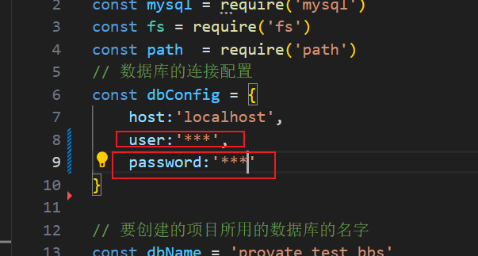

# provateBBS-server

## 前言

本项目用于构建 provateBBS 的 server 端，提供数据服务的接口

## 技术栈

express + fs + mysql

## 项目功能

通过 mysql 对服务所需的数据进行存储以及修改

数据库主要文件 ./db 下的 database.js 和 data.sql

data.sql 中存放对数据库的初始化操作

## 项目运行

首页更改 database.js 中的 config



将用户名，密码改成你使用的数据库的用户名和密码

```
https://github.com/lzb1015/provate-bbs-server.git

cd provate-bbs-server

npm install

node server.js

```

## PS

新手做的项目，很多地方都不足

provateBBS 项目地址：https://github.com/lzb1015/provate-bbs

provateBBS-server 项目地址：https://github.com/lzb1015/provate-bbs-server

provate-bbs-admin 项目地址：https://github.com/lzb1015/provate-bbs-admin
