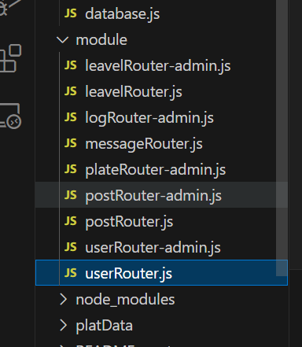

# provateBBS-server

## 前言

本项目用于构建provateBBS的server端，提供数据服务的接口

## 技术栈

express + fs + mysql

## 项目功能

通过mysql对服务所需的数据进行存储以及修改

数据库主要文件 ./db 下的database.js  和data.sql

data.sql中存放对数据库的初始化操作

将客户端的请求模块化



引入jwt生成token，用户记住用户的登陆状态


## 项目运行

首页更改database.js中的config


将用户名，密码改成你使用的数据库的用户名和密码

```
https://gitee.com/piecemeals/provate-bbs-server.git

cd provate-bbs-server

npm install

node server.js

```

## PS

新手做的项目，很多地方都不足

provateBBS 项目地址：https://gitee.com/piecemeals/provate-bbs.git

provateBBS-server 项目地址：https://gitee.com/piecemeals/provate-bbs-server.git

provate-bbs-admin 项目地址：https://gitee.com/piecemeals/provate-bbs-admin.git
